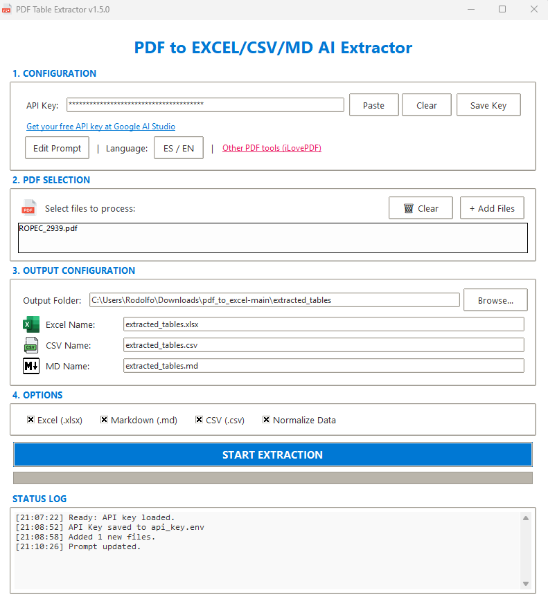
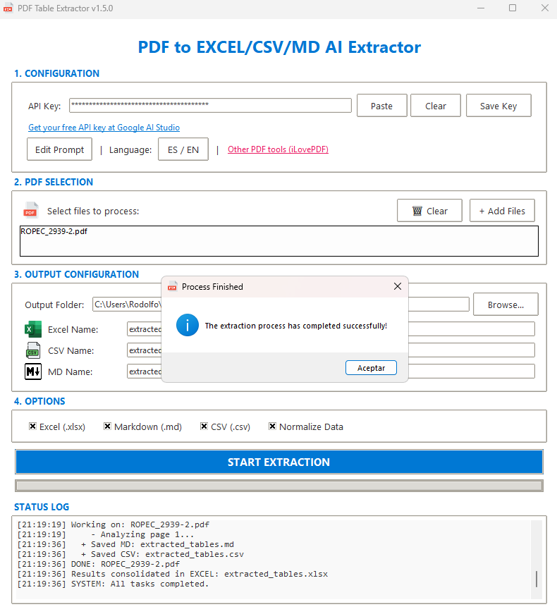
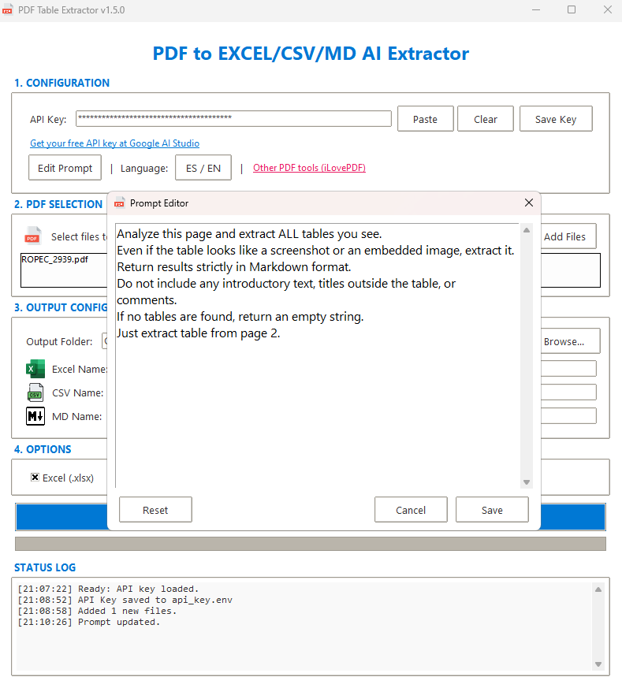

# PDF to EXCEL/CSV/MD AI Extractor

An AI-powered tool that extracts tables from PDF files using Gemini AI.

## � Result Showcase

| 1. Source PDF | 2. Excel Result | 3. Markdown Result | 4. CSV Result |
| :---: | :---: | :---: | :---: |
|  |  |  |  |

## 🖼️ Interface Showcase

| Main Menu | Processing... | Prompt Editor |
| :---: | :---: | :---: |
|  |  |  |

---

## �🚀 How to Run

### **Windows**

1. Double-click **`Windows_exec.bat`**.
2. It will automatically check Python, install dependencies, and create a desktop shortcut for you.

### **Linux & macOS**

1. Open terminal in this folder.
2. Run: `chmod +x Linux_exec.sh`
3. Run: `./Linux_exec.sh`

---

## 📂 Project Structure

- `Windows_exec.bat`: Main launcher for Windows.
- `Linux_exec.sh`: Main launcher for Linux/macOS.
- `src/`: Source code and assets (Internal).
- `docs/`: Full documentation and screenshots.

## 📄 Documentation

- [Full Documentation (English)](docs/User_guide.md)
- [Documentación Completa (Español)](docs/Guia_de_usuario.md)

---

## 💡 Important Note on Excel Results

The output Excel file contains a **"Summary"** sheet followed by a specific data sheet for each processed PDF file. You will find your tables starting from the second sheet.

## 🧠 Selective Processing

You can now ask the AI to process specific pages by modifying the prompt:

- _"Revisa solo la página 2"_
- _"Extraer tablas de las páginas 1 a 3"_
